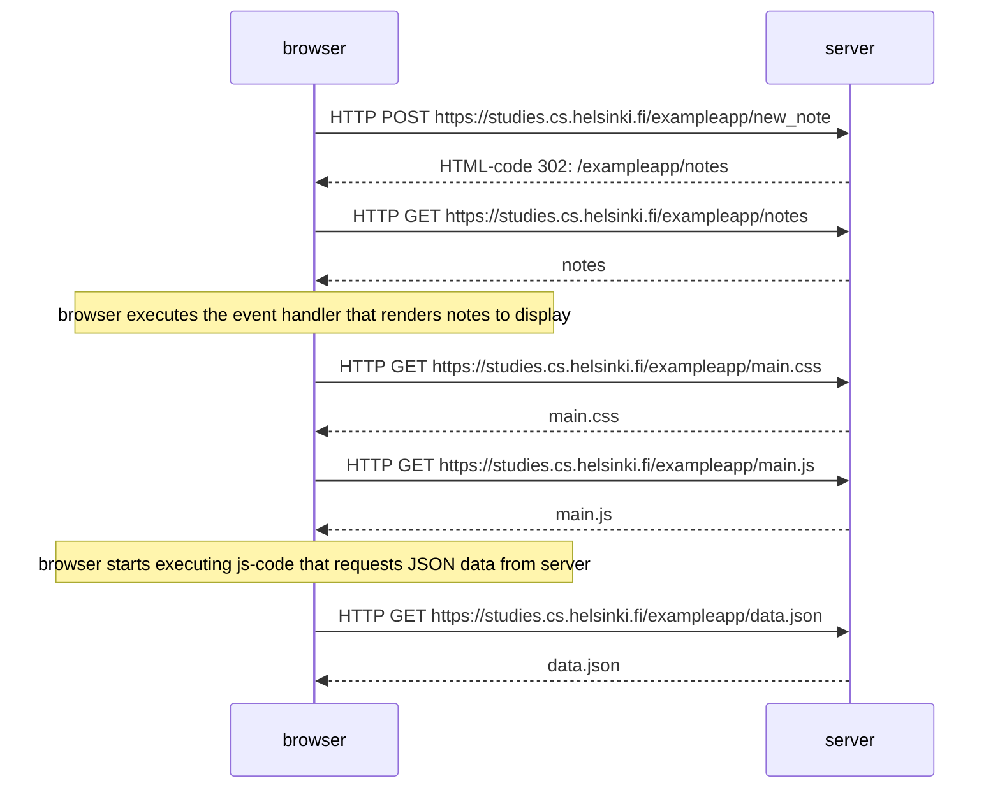

```mermaid
sequenceDiagram
	participant browser
	participant server
	browser->>server: HTTP POST https://studies.cs.helsinki.fi/exampleapp/new_note
	server-->>browser: HTML-code 302: /exampleapp/notes
	browser->>server: HTTP GET https://studies.cs.helsinki.fi/exampleapp/notes
	server-->>browser: notes

	Note over browser: browser executes the event handler that renders notes to display

	browser->>server: HTTP GET https://studies.cs.helsinki.fi/exampleapp/main.css
	server-->>browser: main.css
	browser->>server: HTTP GET https://studies.cs.helsinki.fi/exampleapp/main.js
	server-->>browser: main.js

	Note over browser: browser starts executing js-code that requests JSON data from server 

	browser->>server: HTTP GET https://studies.cs.helsinki.fi/exampleapp/data.json
	server-->>browser: data.json
```
