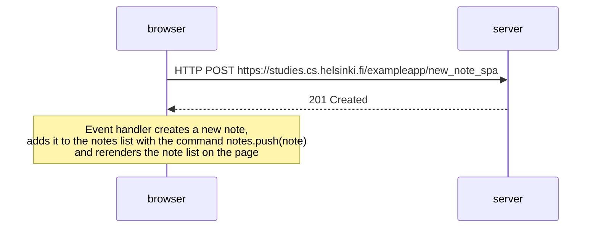

```mermaid
sequenceDiagram
	participant browser
	participant server
	browser->>server: HTTP POST https://studies.cs.helsinki.fi/exampleapp/new_note_spa
	server-->>browser: 201 Created
	Note over browser: Event handler creates a new note,<br>adds it to the notes list with the command notes.push(note)<br>and rerenders the note list on the page
```
