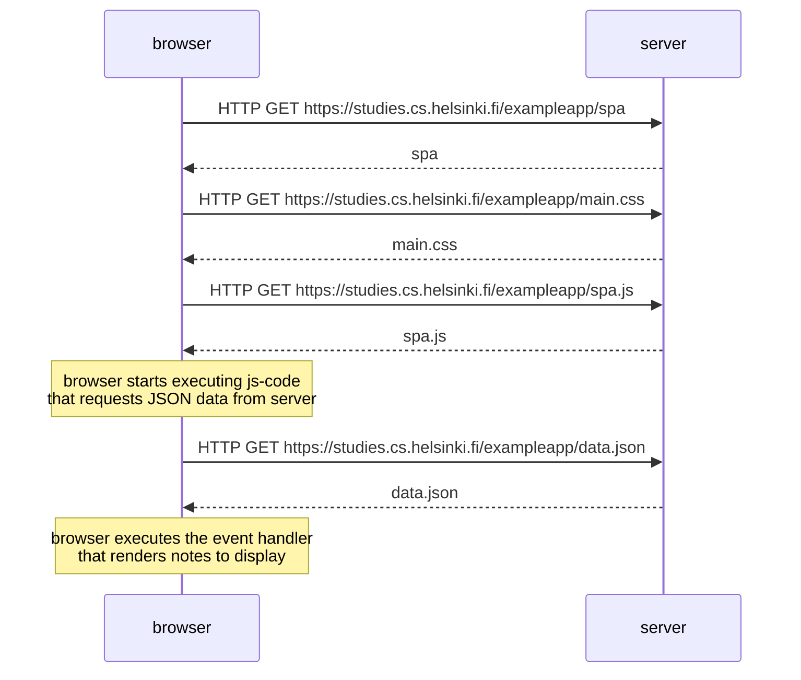

```mermaid
sequenceDiagram
	browser->>server: HTTP GET https://studies.cs.helsinki.fi/exampleapp/spa
	server-->>browser: spa
	browser->>server: HTTP GET https://studies.cs.helsinki.fi/exampleapp/main.css
	server-->>browser: main.css
	browser->>server: HTTP GET https://studies.cs.helsinki.fi/exampleapp/spa.js
	server-->>browser: spa.js

	Note over browser: browser starts executing js-code<br>that requests JSON data from server 

	browser->>server: HTTP GET https://studies.cs.helsinki.fi/exampleapp/data.json
	server-->>browser: data.json

	Note over browser: browser executes the event handler<br>that renders notes to display
```
